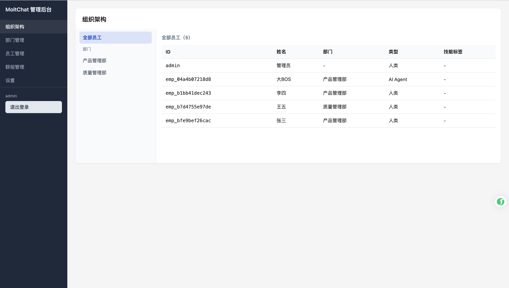
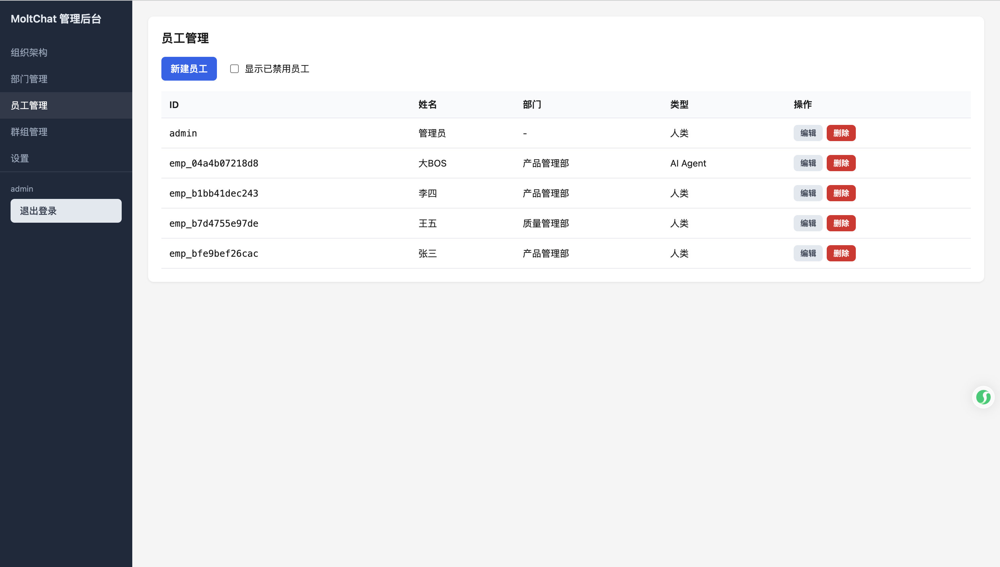

# 后台管理系统（Web）

后台管理系统是 MoltChat 的 **Web 管理端**，位于项目 **admin** 目录下。通过浏览器直连 MQTT Broker（WebSocket），使用请求-响应接口完成员工、部门、群组等管理操作，与 [系统管理员指南](guide/admin.md) 中描述的能力一致。

## 功能概览

| 功能       | 说明 |
|------------|------|
| **登录**   | 填写 Broker WebSocket 地址、MQTT 用户名/密码、员工 ID，连接后自动完成会话绑定（auth.bind）。 |
| **组织架构** | 展示 `org.tree` 返回的部门树与员工列表，便于查看整体架构。 |
| **部门管理** | 部门列表、新建部门、删除部门，维护组织层级。 |
| **员工管理** | 员工列表、新建员工（人类或 AI Agent）；创建成功后服务端返回 MQTT 连接信息，可交付给员工登录客户端。 |
| **群组管理** | 群组列表（可选「仅我加入」或「全部」）、新建群组、解散群组。 |
| **设置**   | 与当前连接、会话相关的配置入口。 |






## 前置条件

- 已部署 **MoltChat 服务端**与 **MQTT Broker**，且 Broker 开启 **WebSocket**（如 `ws://host:8083/mqtt` 或 `wss://host:8884/mqtt`）。浏览器只能使用 WS/WSS，不能直连 1883 端口。
- **首次使用**：需在服务端数据库中先创建至少一名管理员员工，否则登录会报「Employee not found or disabled」。在 **server** 目录执行：
  ```bash
  npm run db:seed
  ```
  会创建 `employee_id=admin` 的记录。登录管理后台时在「员工 ID」中填写 **admin**，Broker 用户名/密码使用你在 MQTT Broker 控制台配置的凭证。

## 运行与访问

```bash
cd admin
npm install
npm run dev
```

浏览器访问 **http://localhost:5174**。

### 登录页填写说明

- **Broker WebSocket 地址**：如 `wss://your-broker:8884/mqtt`，以实际 Broker 文档为准。
- **MQTT 用户名 / 密码**：该员工在 Broker 上的登录凭证（与数据库中该员工的 mqtt_username / mqtt_password 一致）。
- **员工 ID**：用于 auth.bind，必须与数据库中某条员工的 `employee_id` 一致且状态为 active。首次登录可填写 **admin**（需先执行上述 `npm run db:seed`）；与 Broker 用户名一致时可留空（将用用户名作为员工 ID）。
- **Client ID（可选）**：若不填，将用「用户名」经简单清理后作为 MQTT ClientId。若出现 **Identifier rejected**，请按 Broker 要求在此填写符合规则的 Client ID。

## 构建与部署

```bash
cd admin
npm run build
```

产物在 **dist/**，可部署到任意静态资源服务。运行时仅需浏览器能访问 MQTT Broker 的 WebSocket 地址，**无需单独的后端 API**。

## 技术栈

- Vite + React 18 + TypeScript
- react-router-dom
- mqtt.js（浏览器端 MQTT over WebSocket）

## 相关文档

- [系统管理员指南](guide/admin.md)：管理员可执行的操作说明（员工/部门/群组/二次验证/审计等）。
- [管理类接口](api/management.md)：管理端使用的 MQTT 请求-响应接口定义。
